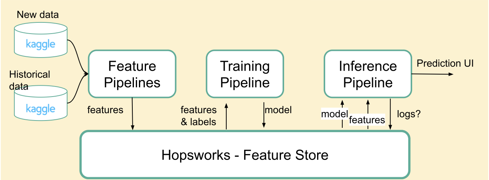
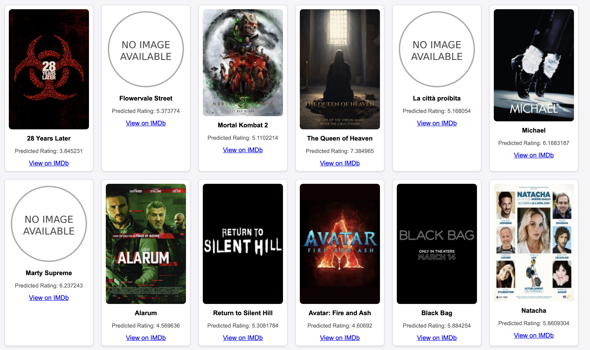

# Serverless Machine Learning System for IMDb Movie Rating Prediction

## Overview

This project is a serverless machine learning system that predicts IMDb ratings for movies using a dynamic dataset from [Kaggle](https://www.kaggle.com/datasets/alanvourch/tmdb-movies-daily-updates/data). The system comprises four main pipelines:

1. **Historical Data Pipeline**: Backfills the feature store with historical data.
2. **Feature Pipeline**: Handles daily data updates.
3. **Training Pipeline**: Trains the machine learning model.
4. **Inference Pipeline**: Uses the trained model to predict ratings for new movies.

A user interface (UI) is available for monitoring predictions. The website allows users to explore different movies, view predicted ratings, and navigate to the IMDb page of a selected movie to see its actual IMDb rating. 

Key technologies used include Hopsworks for the feature store and GitHub Actions for automating daily workflows and pipeline execution.

## Website

The website is available at [Movie Rating Predictor](https://martinebravo.github.io/movie-rating-predictor-service/).

We can see the predicted ratings for 20 newly updated movies, if we click on the movie poster we will be redirected to the IMDb page of the movie to see the actual IMDb rating.

## Dataset

The dataset used is from [Kaggle](https://www.kaggle.com/datasets/alanvourch/tmdb-movies-daily-updates/data), containing the complete movie list from The Movie Database (TMDB) along with IMDb information. It includes 28 columns, such as:

- `vote_average`, `vote_count`, `status`, `release_date`, `revenue`, `runtime`, `budget`
- `imdb_rating`, `imdb_votes`, `original_language`, `overview`, `popularity`, `tagline`
- `genres`, `production_companies`, `production_countries`, `cast`, `producers`, `directors`, `writers`

The dataset is updated daily, ensuring its dynamic nature.

---

## Methodology

### Historical Backfilling
Historical data backfilling was done by filtering movies with the `status` set to "Released," ensuring that IMDb ratings were available for training. Missing data columns were dropped, and data cleaning was performed.

### Feature Engineering
Features ‘vote_average’ and ‘popularity’ were removed since they can be seen as measures of the movie’s rating and we wanted the model to predict the rating without using a similar score as a variable. Since the target to predict was imdb rating, ‘vote_count’ associated with ‘vote_average’ was not relevant either. Release date was converted to release_year, grouping the movies made in the same year together.

We created new features from the “producers”, “cast” and “production_companies” through choosing the first value in each cell creating “first_producer”, “first_actor”, and “first_company” and label encoding them. The “genres” column was also one-hot encoded and uploaded to a new feature group, which then in the training pipeline was merged with the initial feature group.

There was also evaluation done on including or removing the categorical feature original_language and the results showed the model had a lower MSE score and higher R2 value when keeping this variable. The final features used for the training of the models were: budget, runtime, release_year, imdb_votes, original_language, first_producer, first_actor, first_company and the one-hot encoding for the 19 unique genres, giving a total of: 27 features.

Final features used for training included:

- `budget`, `runtime`, `release_year`, `imdb_votes`
- `first_producer`, `first_actor`, `first_company`, `original_language`
- One-hot encoded `genres` (19 unique genres)

This resulted in a total of **27 features**.

### Models

The following models were compared:
- XGB Regressor
- Random Forest Regression
- Linear Regression
- SVR
- Decision Tree Regressor

The **XGB Regressor** emerged as the best-performing model, with an MSE of 0.54 and an R-squared value of 0.58. The Random Forest Regressor performed closely, offering a balance between simplicity and complexity suitable for varying dataset sizes.

### Inference Pipeline
For the inference pipeline, predictions were made for both newly released movies and movies in "Post Production" status. For unreleased movies, an estimated `imdb_votes` value of 400 was used and an average runtime of 124. The website displayed predicted and actual ratings for 20 newly updated movies.

## Results
The results demonstrated the effectiveness of the XGB Regressor, outperforming other models. The inclusion of a mix of simple and complex models ensured adaptability to different data scenarios. We can see that the prediction of the movies is quite accurate, with a small difference between the predicted and actual IMDb ratings. We can see the results of the test data below:

Predicted | Actual
--- | ---
5.857948 | 7.1
6.3983464 | 6.3
5.2628407 | 6.1
4.411699 | 4.2
5.9354286 | 5.9
6.1494517 | 6.1
4.789273 | 4.4
4.68718 | 4.2
4.7766104 | 6.6
6.090134 | 6.3

We can see that some of the predictions are quite close to the actual IMDb rating, with a small difference between the predicted and actual ratings. We also see that some values are not as close, but this is expected since the model is not perfect and there are many factors that can influence the IMDb rating of a movie. The website allows users to explore different movies, view predicted ratings, and navigate to the IMDb page of a selected movie to see its actual IMDb rating.

## How to Run the Code
1. Create a profile on [Hopsworks.ai](https://www.hopsworks.ai/) and obtain an API key.
2. Create a GitHub account to enable the daily workflow.
3. Clone this repository and install the required dependencies.
4. Execute the following steps:
   - Run `1_historical_data.ipynb` to backfill the feature store.
   - Run `3_training_pipeline.ipynb` to train the model.
5. Use GitHub Actions to automate the execution of `2_feature_pipeline.ipynb` and `4_inference_pipeline.ipynb` daily.

