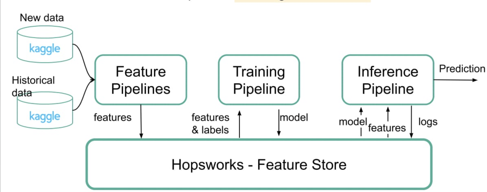

# movie-rating-predictor-service

## What you have done

This is a serverless machine learning system that takes a dynamic movie dataset from Kaggle and predicts the IMDb rating of movies. There are 4 pipelines in this repository: 1_historical_data for backfilling the feature store with historical data, 2_feature_pipeline for the daily updates of data, 3_training_pipeline for training the model and 4_inference_pipeline which uses the trained model and predicts the rating for new movies. 

To monitor the predictions, there is a UI  ______. A website was created where the user can navigate between different movies and see the predicted ratings for the posters displayed. The user can also click on the movie and is then redirected to the IMDb website where they can see the actual IMDb rating. 

Hopsworks is used for the feature store, Github Actions for the daily workflow and running the feature and inference pipeline.

## Dataset

The dataset used for this project was a Kaggle dataset, containing the The Movie Database (TMDB) full movie list and IMDb information. It has a total of 28 columns including: vote_average, vote_count, status, release_date, revenue, runtime, budget, imdb_rating, imdb_votes, original_language, overview, popularity, tagline, genres, production_companies, production_countries, cast, producers, directors and writers. The dataset is updated everyday making it dynamic.

## Method

### Historical backfilling:
The historical data was done through filtering on the status of the movie as “Released”, as there otherwise is no imdb_rating to use for the target value in training and as there could be missing values for the features used. Data cleaning was also performed where columns with missing data were dropped and duplicates were dropped.

### Feature engineering:
Features ‘vote_avera ge’ and ‘popularity’ were removed since they can be seen as measures of the movie’s rating and we wanted the model to predict the rating without using a similar score as a variable. Since the target to predict was imdb rating, ‘vote_count’ associated with ‘vote_average’ was not relevant either. Release date was converted to release_year, grouping the movies made in the same year together.

We created new features from the “producers”, “cast” and “production_companies” through choosing the first value in each cell creating “first_producer”, “first_actor”, and “first_company” and label encoding them. The “genres” column was also one-hot encoded and uploaded to a new feature group, which then in the training pipeline was merged with the initial feature group.

There was also evaluation done on including or removing the categorical feature spoken-language and the results showed the model had a lower MSE score and higher R2 rating when removing this variable. The final features used for the training of the models were: budget, runtime, release_year, imdb_votes, first_producer, first_actor, first_company, spoken_language and the one-hot encoding for the 19 unique genres, giving a total of: 27 features.

## Models:
The models compared were: XGB Regressor, Random Forest Regression, Linear Regression, SVR and Decision Tree Regressor. 

For the prediction of the inference pipeline, we thought it would be fun to predict the rating for movies that have not been released yet, so apart from the available predictions that are from the updated data, the movies with status “Post Production” were used to predict. For the “imdb_votes” feature an estimate of 400 was chosen to the new movies. To monitor the pipeline, the website also showed the predicted rating and the actual rating for 20 newly updated movies _______. As shown below: ___

## Results
From the results it can be seen that the best performing model was the XGB Regressor, with the Random Forest Regressor coming in close second place. This to include more simple models as well as more complex models, suitable to different dataset sizes.

The XGBoost Regressor had an MSE value of 0.51 and R squared value of 0.60.

## How to run the code

To run the code a user has to create a profile on Hopsworks.ai to get an API key and a Github Account to be able to run the daily workflow. Then they can clone this repository and install the requirements. Run 1_historical_data.ipynb and then the 3_training_pipeline.ipynb. Through Github Actions to run the 2_feature_pipeline.ipynb and 4_inference_pipeline.ipynb daily.
